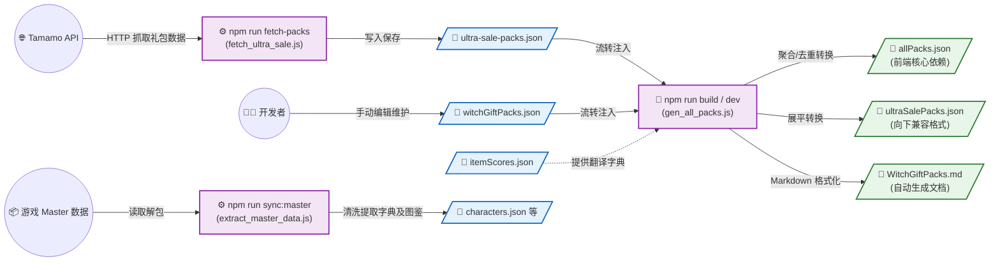

# 核心数据流转与更新流程

本文档梳理了项目中各类核心数据（包括 Master 解包数据字典、超值特卖、魔女的赠礼等）的提取、清洗与构建流程。整个体系分为手动或按需触发的基础数据获取阶段，以及前端打包时前置钩子自动完成的数据聚合转换阶段。

## 数据流转架构

## 常用更新操作说明

1. **同步 Master 解包数据**：当游戏发布新角色、新图鉴等大版本更新后，执行 `npm run sync:master`。这会更新 `characters.json` 和 `mysterium_data.json` 等基础核心数据字典。
2. **更新超值特卖**：执行 `npm run fetch-packs` 获取最新数据，检查变动后 Commit。
3. **更新魔女赠礼**：手动修改 `src/constants/witchGiftPacks.json` 配置文件。
4. **完成最终打包与验证**：执行 `npm run build` 或 `npm run dev`，构建脚本会自动将上述最新的基础数据源整合成前端应用最终需要的数据产物。

## 💡 Git 追踪策略与说明
为了保持仓库的纯净和自动化流程的稳定运行，项目对脚本和生成物采用了混合追踪策略：
- **默认拦截**：通过 `.gitignore` 黑名单，拦截了 `scripts/` 与 `doc/items/` 目录下的所有一次性本地爬虫、解包测试脚本与临时产物。
- **特定放行**：通过白名单强制追踪了参与 Web 打包流程的必须项（如 `gen_all_packs.js` 脚本、`ultra-sale-packs.json` 数据），以确保远端 GitHub Actions 的 CI/CD 线上构建不会因为缺失依赖而崩溃。
