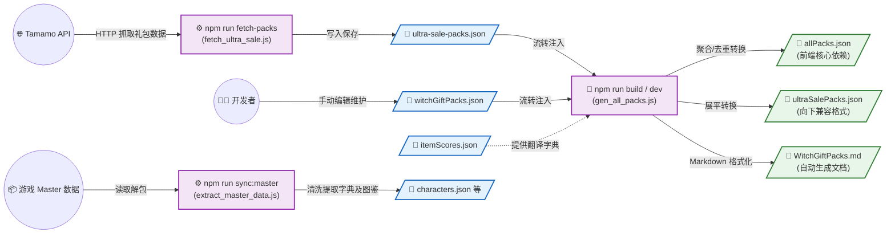

# 核心数据流转与更新流程

本文档梳理了项目中各类核心数据（包括 Master 解包数据字典、超值特卖、魔女的赠礼等）的提取、清洗与构建流程。整个体系分为手动或按需触发的基础数据获取阶段，以及前端打包时前置钩子自动完成的数据聚合转换阶段。

## 数据流转架构

```mermaid
flowchart LR
    %% 外部数据源 (External Entities)
    API(("🌐 Tamamo API"))
    Editor(("🧑‍💻 开发者"))
    Master(("📦 游戏 Master 数据"))

    %% 数据处理脚本 (Processes)
    FetchProc["⚙️ npm run fetch-packs\n(fetch_ultra_sale.js)"]
    SyncProc["⚙️ npm run sync:master\n(extract_master_data.js)"]
    BuildProc["🔨 npm run build / dev\n(gen_all_packs.js)"]

    %% 数据源文件 (Data Stores)
    UltraJSON[/"📄 ultra-sale-packs.json"/]
    WitchJSON[/"📄 witchGiftPacks.json"/]
    DictJSON[/"📄 itemScores.json"/]
    BaseData[/"📄 characters.json 等"/]
    
    %% 最终产物文件 (Output Data Stores)
    AllPacksJSON[/"📄 allPacks.json\n(前端核心依赖)"/]
    UltraFlatJSON[/"📄 ultraSalePacks.json\n(向下兼容格式)"/]
    WitchMD[/"📝 WitchGiftPacks.md\n(自动生成文档)"/]

    %% --------- 数据流向 (Data Flows) ---------
    API -- "HTTP 抓取礼包数据" --> FetchProc
    FetchProc -- "写入保存" --> UltraJSON

    Editor -- "手动编辑维护" --> WitchJSON

    Master -- "读取解包" --> SyncProc
    SyncProc -- "清洗提取字典及图鉴" --> BaseData

    UltraJSON -- "流转注入" --> BuildProc
    WitchJSON -- "流转注入" --> BuildProc
    DictJSON -. "提供翻译字典" .-> BuildProc

    BuildProc -- "聚合/去重转换" --> AllPacksJSON
    BuildProc -- "展平转换" --> UltraFlatJSON
    BuildProc -- "Markdown 格式化" --> WitchMD

    %% 样式区分
    classDef process fill:#f3e5f5,stroke:#8e24aa,stroke-width:2px;
    classDef data fill:#e3f2fd,stroke:#1565c0,stroke-width:2px;
    classDef output fill:#e8f5e9,stroke:#2e7d32,stroke-width:2px;
    
    class FetchProc,SyncProc,BuildProc process;
    class UltraJSON,WitchJSON,DictJSON,BaseData data;
    class AllPacksJSON,UltraFlatJSON,WitchMD output;
```

## 常用更新操作说明

### GitHub Actions 增量同步

- `Sync Master Data` 每小时整点检查上游 `moonheart/mementomori-masterbook` 的提交 SHA。处理缓存键同时包含本库脚本、工具函数、常量、评分输入、工作流和依赖配置的摘要；任一变化都会重新生成。上游检出固定到查询得到的 SHA，避免查询与下载之间的新提交造成误标记。
- 命中处理缓存时，跳过上游仓库下载、Node 设置、数据生成和评分审计。未命中时仍按原流程生成并比较 `public/data/`；生成与必要的提交推送全部成功后才缓存处理记录。
- 数据和图片的内容摘要单独与成功发布缓存比较。未发布的内容才调用图片同步及 Pages 部署；数据已提交但部署失败时，下次小时检查仍会重试发布。发布缓存只在 Pages 成功后写入，记录部署实际检出的内容，避免把并发到达的新内容提前标为已发布。
- `Sync Image Assets` 保留手动入口，并于每天北京时间 **16:20** 补查延迟上线的图片；独立补查仅在图片发生变化时部署。主同步调用图片流程后统一负责部署，避免重复发布。
- 手动运行 `Sync Master Data` 时勾选 `force` 可强制重新生成、检查图片并部署。普通手动运行遵循与定时相同的缓存判断。代码推送仍直接触发部署。
- 缓存只用于优化，不是数据源；首次运行或缓存被淘汰时会安全地重做检查／发布。无变化的小时检查仍需启动一个 runner、检出本库、查询上游和查找两个缓存，但不会启动图片与部署任务。
- 图片补查失败可手动重跑 `Sync Image Assets`；图片提交成功而发布失败时，小时检查也会因内容未发布而重试。评分仍只标记 stale/pending，不自动重评角色。

1. **同步 Master 解包数据**：当游戏发布新角色、新图鉴等大版本更新后，执行 `npm run sync:master`。这会更新 `characters.json` 和 `mysterium_data.json` 等基础核心数据字典。
2. **更新超值特卖**：执行 `npm run fetch-packs` 获取最新数据，检查变动后 Commit。
3. **更新魔女赠礼**：手动修改 `src/constants/witchGiftPacks.json` 配置文件。
4. **完成最终打包与验证**：执行 `npm run build` 或 `npm run dev`，构建脚本会自动将上述最新的基础数据源整合成前端应用最终需要的数据产物。

## 💡 Git 追踪策略与说明
为了保持仓库的纯净和自动化流程的稳定运行，项目对脚本和生成物采用了混合追踪策略：
- **默认拦截**：通过 `.gitignore` 黑名单，拦截了 `scripts/` 与 `doc/items/` 目录下的所有一次性本地爬虫、解包测试脚本与临时产物。
- **特定放行**：通过白名单强制追踪了参与 Web 打包流程的必须项（如 `gen_all_packs.js` 脚本、`ultra-sale-packs.json` 数据），以确保远端 GitHub Actions 的 CI/CD 线上构建不会因为缺失依赖而崩溃。
