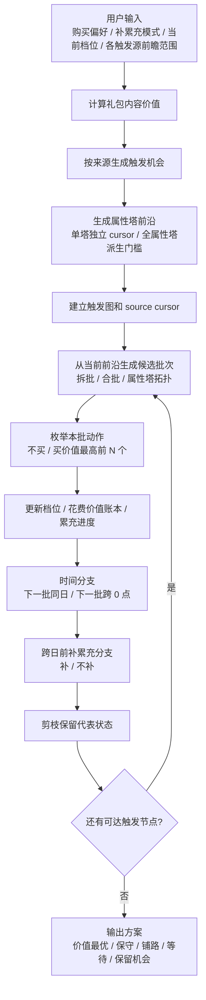
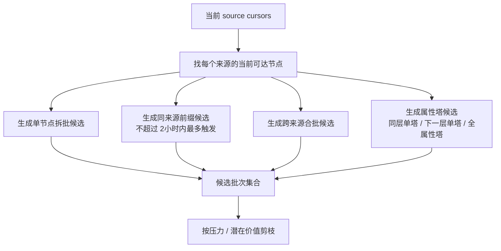
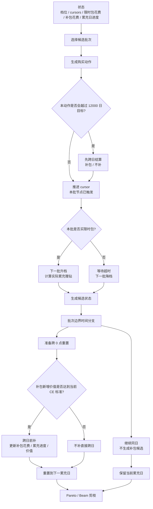
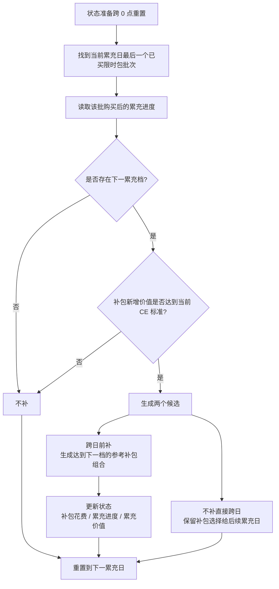

# 限时组合包路径算法直观版

本文用流程图和伪代码展示购买路径计算流程。完整实现设计见 `implementation-design.md`。

## 总览流程



## 批次编排流程



未进入当前候选批次的触发节点不算已触发，不推进 cursor，可以留到后续档位变化后再触发。

## 状态转移流程



每日累充重置只发生在两个全局批次之间。同一批内的限时包和补包都按同一个累充日计算。

属性塔使用单塔独立前沿。批次编排与拓扑层级没有直接强制换日关系；强制重置只由当前累充日内是否再次推进同一单塔决定。若当前累充日已处理 `blue250`，下一批前沿仍可同时包含 `red/green/yellow250` 和 `blue300`；只有实际触发 `blue300` 这类再次推进蓝塔的候选需要强制重置，触发其他属性塔不强制重置。

## 核心伪代码

```text
function buildPlans(packs, settings):
  packsWithValue = calculatePackCE(packs)
  context = buildPlanningContext(packsWithValue, settings)

  candidates = collectTopValuePlans(context)
  retention = createRetentionBaseline(context)

  return classifyPlanOptions(candidates, retention)
```

```text
function searchBestValuePlan(context):
  states = [emptyState(context)]

  while states has unfinished trigger cursors:
    nextStates = []

    for state in states:
      batches = generateBatchCandidates(state.sourceCursors)

      for batch in batches:
        actions = generatePurchaseActions(batch, state.tierIndex)

        for action in actions:
          candidate = applyBatchAndPurchase(state, batch, action)

          nextStates.add(continueSameRechargeDay(candidate))

          if shouldKeepNextDayBranch(candidate):
            for branch in expandBeforeRechargeReset(candidate):
              nextStates.add(branch)

    states = pruneBySearchPriority(nextStates)

  return candidate pool ranked by decision value
```

## 补累充流程



补包只使用非首次常驻钻石组合包。补包不会触发限时包，也不会影响限时包升降档。继续同一累充日的分支不会生成补包候选。
