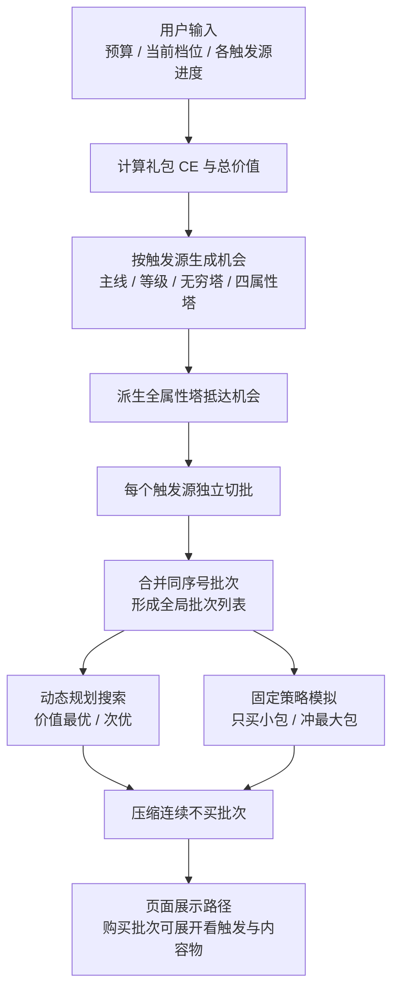
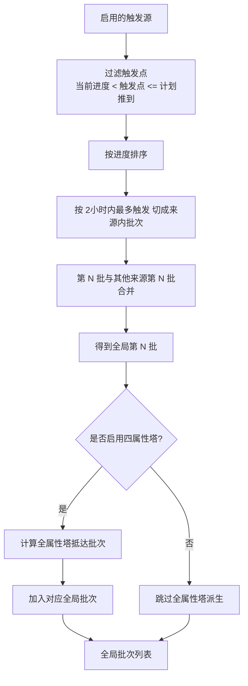
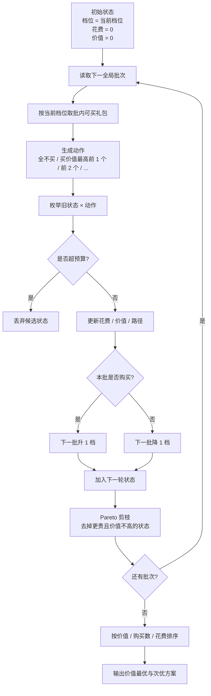

# 限时组合包路径算法直观版

本文用流程图和伪代码展示购买路径计算流程。完整算法说明见 `path-planning-algorithm.md`。

## 总览流程



## 批次生成流程



## 动态规划流程



## 核心伪代码

```text
function buildPlans(packs, settings):
  packsWithValue = calculatePackCE(packs)
  context = buildPlanningContext(packsWithValue, settings)

  bestPlans = dynamicProgramming(context, topK = 2)
  smallPackPlan = simulatePolicy(context, "smallPack")
  maxPackPlan = simulatePolicy(context, "maxPack")

  return [
    bestPlans[0],
    bestPlans[1],
    smallPackPlan,
    maxPackPlan
  ]
```

```text
function buildPlanningContext(packs, settings):
  priceTiers = sortedUniquePackPrices(packs)
  lanes = enabledTriggerSources(settings)

  laneBatches = []
  for lane in lanes:
    opportunities = filterPacksByLaneAndProgress(packs, lane)
    opportunities = sortByTriggerProgress(opportunities)
    laneBatches.append(splitByBatchSize(opportunities, lane.batchSize))

  allTowerEntries = deriveAllTowerOpportunities(packs, lanes)

  globalBatches = []
  for batchIndex from 0 to maxBatchCount:
    batch = mergeSameIndexBatches(laneBatches, batchIndex)
    batch.add(allTowerEntries at batchIndex)
    globalBatches.append(sortBatch(batch))

  return { priceTiers, globalBatches, budget, startTierIndex }
```

```text
function dynamicProgramming(context, topK):
  states = {
    key(context.startTierIndex, 0): [emptyState]
  }

  for batch in context.globalBatches:
    nextStates = {}

    for state in all states:
      tierPrice = context.priceTiers[state.tierIndex]
      actions = buildActions(batch, tierPrice)

      for action in actions:
        newSpent = state.spent + action.cost
        if newSpent > context.budget:
          continue

        if action.bought:
          nextTierIndex = state.tierIndex + 1
        else:
          nextTierIndex = state.tierIndex - 1

        nextTierIndex = clampToValidTier(nextTierIndex)

        candidate = {
          tierIndex: nextTierIndex,
          spent: newSpent,
          value: state.value + action.value,
          purchases: state.purchases + count(action.purchases),
          steps: state.steps + summarize(action, batch)
        }

        insertCandidate(nextStates, candidate, topK)

    states = pruneByParetoAndLimit(nextStates)

  return takeTopK(sortPlans(all states), topK)
```

## 单批动作示意

假设某个全局批次中，当前档位可买 3 个礼包：

| 触发 | 价值 | 价格 |
| --- | ---: | ---: |
| 主线 10-28 | 1500 | 160 |
| 无穷塔 180 | 1200 | 160 |
| 蓝塔 80 | 900 | 160 |

先按价值排序后，动作只枚举前缀：

| 动作 | 购买内容 | 是否升档 |
| --- | --- | --- |
| 全不买 | 无 | 否，下一批降档 |
| 买 1 个 | 主线 10-28 | 是，下一批升档 |
| 买 2 个 | 主线 10-28 + 无穷塔 180 | 是，下一批升档 |
| 买 3 个 | 主线 10-28 + 无穷塔 180 + 蓝塔 80 | 是，下一批升档 |

不会枚举“只买无穷塔 180”这类子集，因为同档礼包价格相同，买 1 个时选最高价值礼包一定不差。

## 状态剪枝示意

同一档位下，若有以下候选状态：

| 状态 | 已花费 | 已价值 |
| --- | ---: | ---: |
| A | 160 | 1000 |
| B | 650 | 900 |
| C | 810 | 1800 |

B 会被剪掉，因为它比 A 花费更多，但价值更低。

保留 A 和 C，因为 C 虽然更贵，但价值也更高，后续仍可能成为最优路径的一部分。

## 路径展示压缩

算法内部仍保留每个批次的完整 step。页面展示时再压缩连续不买：

```text
原始路径:
第 1 批 买
第 2 批 不买
第 3 批 不买
第 4 批 不买
第 5 批 买

展示路径:
第 1 批 买
第 2-4 批 连续不买 ×3
第 5 批 买
```

购买批次不会压缩，因为需要展开查看每个礼包的触发点、价格、CE、价值和内容物。
